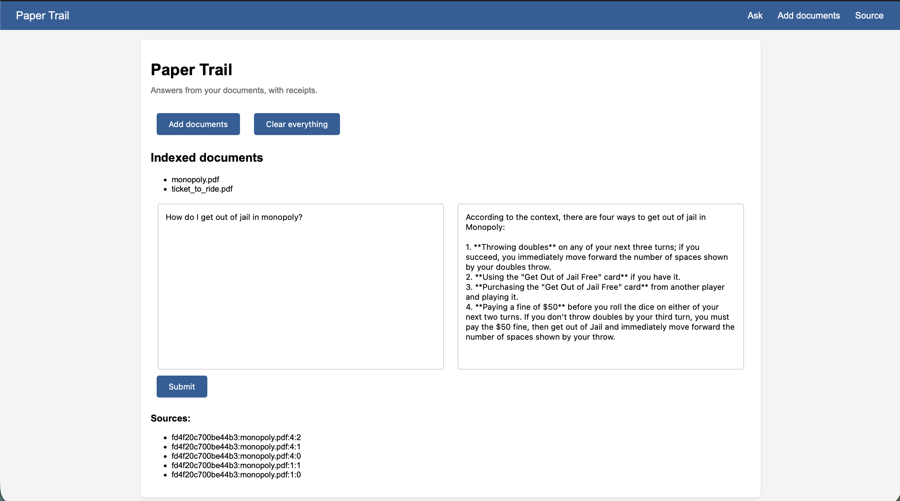
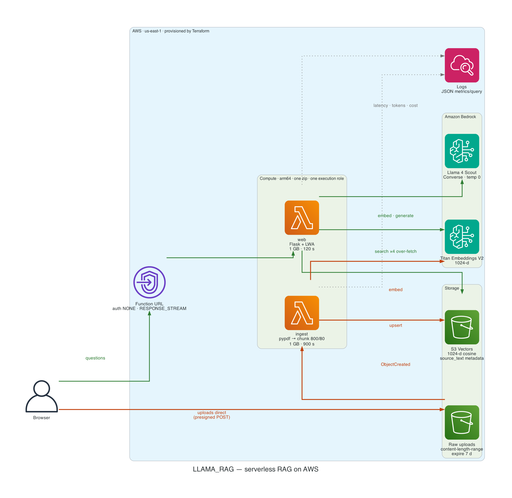
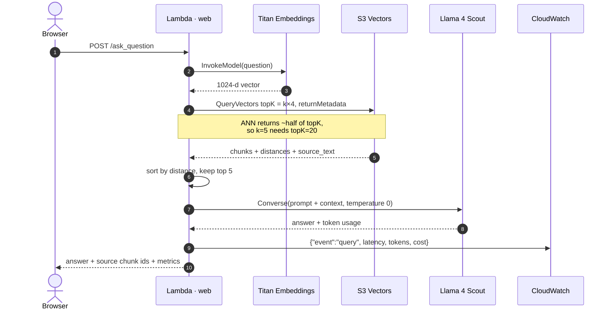
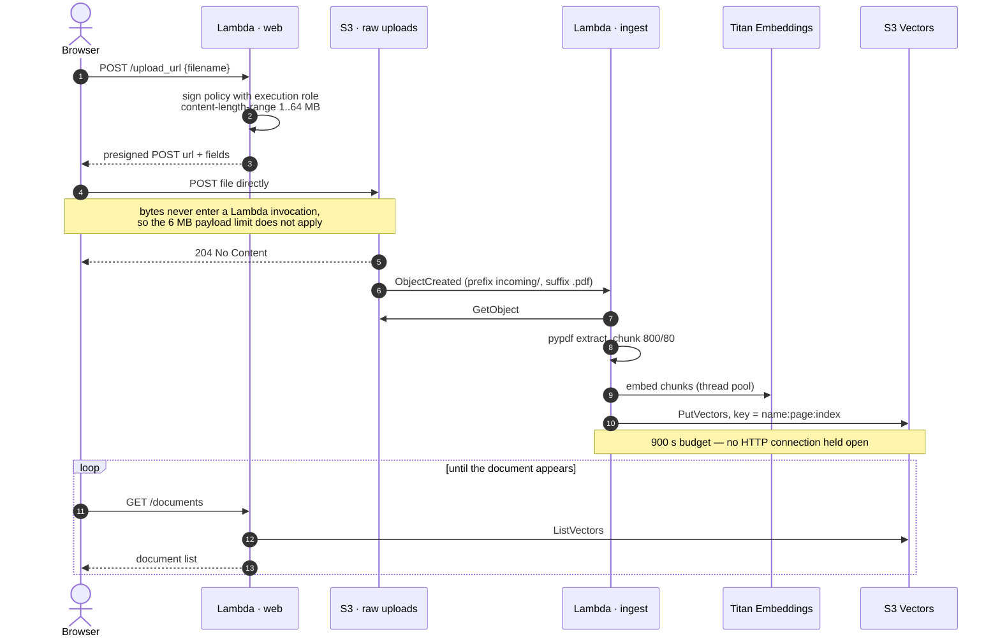

# Paper Trail

Upload PDFs, ask questions, get answers grounded in your own documents — every claim cited back to the passage it came from.

A production-shaped serverless RAG system on AWS: session-isolated, evaluated, deployed, and torn down with one command each.

Flask · Amazon S3 Vectors · Amazon Bedrock (Titan embeddings + Llama 4) · Terraform

<!-- deploy:url -->
**[Live demo →](https://2y5mc2diynm6gdhw73r5gr5try0rfanw.lambda-url.us-east-1.on.aws/)**
<!-- /deploy:url -->



## Engineering highlights

**The eval harness caught a silent retrieval bug in production.** S3 Vectors is an approximate index and returns *fewer results than requested* — measured at roughly half:

| requested `topK` | actually returned |
|---|---|
| 5 | **2** |
| 20 | 10 |
| 100 | 40 (whole index) |

So `k=5` was quietly supplying the model with **2 chunks of context instead of 5**, degrading every answer, with nothing in the app aware of it. It surfaced when the golden set failed on *retrieval* during an unrelated refactor. Fixed by over-fetching `k × 4` and re-ranking by distance — the mitigation AWS documents for this. ([full write-up](docs/DECISIONS.md#13-over-fetch-from-s3-vectors))

**Every significant choice is backed by a measurement, not a preference:**

| Decision | Evidence |
|---|---|
| Llama 4 Scout for generation | 4 candidates scored against the golden set; chosen on latency once quality tied |
| Removed LangChain, kept only the text splitter | 13 packages for a ~150-line app; replacement diff was +119/−108 lines |
| Kept `langchain-text-splitters` | 2.9 MB of 305 MB — measured before deciding, not assumed |
| S3 Vectors over OpenSearch Serverless | ~90% cheaper; vector lookup isn't the dominant latency term here |
| 1024-dim embeddings (not 512) | Storage saving priced at ~$0.001/month against a permanently immutable index |

**Production behaviour that isn't obvious from a tutorial:** Bedrock model access is account-level and diagnosable by testing with admin credentials · Llama 3.1+ is `INFERENCE_PROFILE`-only and needs wildcard-region IAM · `s3vectors:QueryVectors` alone can't return metadata · IAM is eventually consistent after an apply · Lambda's 6 MB invocation limit is why uploads go direct to S3.

Dependencies went from **116 packages / 305 MB to 52 / 62 MB** — which is what made a zip-based Lambda deploy possible at all.

## Architecture

Everything inside the boundary is provisioned by Terraform. Two Lambdas share one deployment package and one execution role; no static AWS credentials exist anywhere in the deployed system.



*Generated from [`docs/diagram.py`](docs/diagram.py) — diagram as code, regenerate with `uv run python docs/diagram.py`.*

**Green is the query path, orange is the upload path** — and they never meet.

### Request flow — asking a question



### Ingestion flow — uploading a document

The presigned handshake is the part worth reading: the app signs an upload policy with its execution role, and the browser then sends the bytes **straight to S3**. Nothing large ever passes through a Lambda invocation.



Because ingestion is asynchronous, "upload returned" doesn't mean "ready to query" — hence the polling loop. Chunk ids key on the document *name*, not the staging path, so re-uploading the same file is a no-op rather than a duplicate set.

| Component | Configuration |
|---|---|
| Function URL | `authorization_type NONE`, `invoke_mode RESPONSE_STREAM` |
| Lambda `web` | arm64, 1 GB, 120 s, Lambda Web Adapter layer, execution role (no static keys) |
| Lambda `ingest` | arm64, 1 GB, **900 s**, same zip, `ingest.handler` |
| S3 raw uploads | presigned POST with `content-length-range`, objects expire after 7 days |
| S3 Vectors | 1024-d, cosine, `source_text` non-filterable, queried with ×4 over-fetch |
| Bedrock | `amazon.titan-embed-text-v2:0` · `us.meta.llama4-scout-17b-instruct-v1:0` at `temperature 0` |
| CloudWatch | 14-day retention; one structured JSON metrics line per query |

**Why S3 Vectors.** It is the cost-optimized tier, not the low-latency tier: AWS quotes ~100 ms for warm indexes and sub-second for cold ones, versus single-digit ms for an in-memory HNSW index — in exchange for roughly 90% lower cost than a traditional vector database. At this corpus size the vector lookup is nowhere near the dominant latency term (generation is), so the trade is free. A high-QPS consumer app would tier the hot subset into OpenSearch Serverless and keep the cold corpus here.

**No LangChain, no SDK sprawl.** The pipeline calls `pypdf` and `boto3` directly — one AWS SDK covers embeddings, vector storage, and generation. The only third-party piece retained is `langchain-text-splitters`, the one component with non-trivial logic. Removing the rest took the install from **116 packages / 305 MB to 52 / 62 MB**, which is what makes a Lambda deployment viable.

**Model chosen by measurement.** Four candidates were scored against the golden set before picking one:

| Model | Score | Avg latency |
|---|---|---|
| `us.meta.llama4-scout-17b-instruct-v1:0` | 6/6 | **0.53s** |
| `us.meta.llama4-maverick-17b-instruct-v1:0` | 6/6 | 0.53s |
| `meta.llama3-70b-instruct-v1:0` | 6/6 | 0.69s |
| `us.meta.llama3-3-70b-instruct-v1:0` | 6/6 | 0.82s |

All four saturate the current golden set, so the choice came down to latency and cost — Scout is the cheapest of the two fastest. A set this small can't discriminate on quality; harder cases would be needed to justify a larger model.

## Evals

Retrieval quality is measured, not assumed. `test_rag.py` is a golden set of factual questions whose answers were verified to exist in the source PDFs, plus an out-of-corpus question that must be *declined* rather than answered.

Each case runs twice — once against retrieval alone, once end-to-end — so a failure localizes immediately:

| Retrieval | Answer | Diagnosis |
|---|---|---|
| ✅ | ❌ | Chunk was found; the model failed to use it |
| ❌ | ❌ | Embeddings, chunking, or `k` — not generation |

```bash
uv run pytest                          # everything — 21 tests
uv run pytest test_behaviour.py        # 10 behaviour tests, ~0.3s, no AWS needed
uv run pytest test_rag.py              # 11 golden-set tests, real Bedrock + S3 Vectors
```

**Current state: 21/21 passing.** Two suites with different jobs:

| Suite | Speed | Needs AWS | Catches |
|---|---|---|---|
| `test_behaviour.py` | 0.3 s | no | contract breaks, session leakage, route behaviour |
| `test_rag.py` | ~6 s | yes | retrieval and answer quality |

The behaviour suite runs against in-memory fakes, so it gives real signal on every push even while the stack is torn down. Each test corresponds to a bug this project actually shipped — and each was verified to *fail* when its bug is reintroduced, because a suite that stays green on a broken app is worse than none.

Run the golden set before and after any change to the embedding model, chunk size, `k`, the prompt, or the vector store.

`conftest.py` prints the resolved region, index, embedding model, and LLM in the pytest header — eval numbers mean nothing without knowing which model produced them — and warns when a shell environment variable is shadowing `.env`.

## Setup

Prerequisites: an AWS account, [Terraform](https://developer.hashicorp.com/terraform/install), [uv](https://docs.astral.sh/uv/getting-started/installation/), and AWS credentials for an **IAM user** (not the account root — AWS forbids root from assuming roles, which local development relies on).

```bash
cd infra && terraform init && cd ..
./deploy/deploy.sh                                   # build → apply → publish → verify
terraform -chdir=infra output -raw aws_profile >> ~/.aws/config   # one-time
```

`deploy.sh` runs the three steps in order and **fails if the deployed build doesn't match your HEAD commit** — Terraform reports "no changes" when the zip is stale, so without that check old code keeps serving silently.

Then run it locally against the same infrastructure:

```bash
uv venv && uv pip install -r requirements.txt
uv run python app.py          # http://127.0.0.1:5000
```

**No long-lived credentials anywhere.** Lambda uses an execution role, CI uses GitHub OIDC, and local development assumes a least-privilege role via a named AWS profile — so `.env` holds configuration only (which bucket, which index, which models) and never a secret.

Don't `source .env`: it exports `AWS_PROFILE`, which then outranks your admin profile and makes Terraform fail with `AccessDenied` on IAM. The app loads it in-process via `python-dotenv`.

**Tear down** when you're finished — this deletes everything, including stored vectors:

```bash
cd infra && terraform destroy && cd ..
./deploy/publish.sh --down      # marks the README as not deployed
./deploy/verify_teardown.sh     # confirms nothing survived
```

## Cost

Roughly **$1–3/month** at portfolio traffic. S3 Vectors storage is $0.06/GB-month (this corpus is ~20 MB, so a fraction of a cent); Bedrock is per-token; Lambda scales to zero. The Terraform config provisions a budget alert so a runaway ingestion loop can't surprise you.

## Notable implementation details

- **`force_destroy = true`** on the vector bucket — without it, `terraform destroy` fails while the index still holds vectors, and it only takes effect if applied beforehand.
- **`s3vectors:GetVectors` is required alongside `QueryVectors`.** `QueryVectors` alone returns only keys and distances; requesting metadata (needed for chunk text) fails with AccessDenied otherwise.
- **Index settings are immutable.** Dimension, distance metric, and non-filterable metadata keys cannot be changed — altering them rebuilds the index and drops every vector.
- **Chunk text is non-filterable metadata.** Filterable metadata is capped at 2 KB/vector; `source` and `page` stay filterable for per-document queries.
- **Llama 3.1+ requires the `us.` inference-profile prefix.** Those models are `INFERENCE_PROFILE`-only; a bare model id fails. The IAM policy needs `InvokeModel` on both the profile ARN and the underlying model with a wildcard region.
- **Generation runs at `temperature=0`** — this is extraction from supplied context, not creative writing.
- **Meta models need no access request.** Anthropic models on Bedrock require a one-time console opt-in and 403 until granted, which is why this defaults to Llama.

## Deploy publicly

```bash
./deploy/build.sh                     # cross-compiles linux/arm64 wheels, ~29 MB zip
cd infra && terraform apply
terraform output -raw public_url
```

The build needs no Docker — `uv --python-platform aarch64-manylinux2014` produces Linux wheels on macOS. Re-deploy after a code change by re-running both commands; `source_code_hash` triggers the update.

**Uploads bypass Lambda entirely.** The browser gets a presigned POST and sends the file straight to S3 (Lambda caps invocation payloads at 6 MB); an S3 event then triggers a separate ingestion Lambda with a 900 s timeout, so embedding a large PDF never blocks an HTTP request. Verified in production with a 7.3 MB PDF.

**Architecture:** Flask runs unmodified under the [AWS Lambda Web Adapter](https://github.com/aws/aws-lambda-web-adapter) (an `/opt/extensions` layer), fronted by a Lambda **Function URL** — chosen over API Gateway because Function URLs support response streaming. The Lambda uses an execution role, so no AWS keys exist in the deployed environment.

**This endpoint is public and unauthenticated, and every request spends Bedrock tokens.** `reserved_concurrent_executions = 5` bounds concurrent spend, alongside the budget alarm. Set `max_concurrency = 0` to disable the function without tearing anything down. For more than a demo, put CloudFront + WAF rate rules in front.

## Tracing

Every question produces a nested trace, from four `@traceable` decorators and **no new dependencies** — `langsmith` already ships with `langchain-core`:

```
query_rag  [chain]
  └─ embed_query        [embedding]   Titan
  └─ s3_vectors_search  [retriever]   chunks + distances
  └─ bedrock_converse   [llm]         prompt, completion, tokens
```

```bash
export LANGSMITH_TRACING=true LANGSMITH_API_KEY=ls__...
uv run python app.py
```

Click the `retriever` span to see exactly which chunks were retrieved and at what distance; click `llm` for the prompt the model actually received. That is the "a user says the answer was wrong" workflow, and it is the piece that per-call logging structurally cannot provide — the S3 Vectors query is not a model call, so it appears in no model log.

**LangSmith's tracing was never LangChain-specific.** `@traceable` decorates any Python function, so the retrieval path stays framework-free while still producing the same trace view a LangChain application gives.

Tracing is **off by default in production**: it costs an egress call per request, and LangSmith's background exporter is killed by the Lambda freeze unless `wait_for_all_tracers()` is called before returning. Enable it per-invocation when debugging. Overhead when disabled is ~12 µs per decorated call — 36 µs against a ~780 ms request.

For an always-on in-account audit, Amazon Bedrock **model invocation logging** records every prompt and completion with zero code and zero package weight (Terraform: `aws_bedrock_model_invocation_logging_configuration`; set `embedding_data_delivery_enabled = false` or every Titan call logs a 1024-float array).

## Session isolation

The endpoint is public, so one visitor must never see another's documents. Four mechanisms, three of them enforced by systems rather than by convention:

| Layer | Enforced by |
|---|---|
| `sid` in the Flask cookie | **HMAC signature** — you cannot forge another session's id |
| Retrieval scoping | **S3 Vectors server-side filter**, applied during search |
| Upload path `incoming/{sid}/…` | **S3 presigned POST policy** pins the exact key |
| Chunk id `{sid}:file:page:idx` | convention only — used for cleanup grouping, not a boundary |

`session_id` is a **required positional argument** on `search()`, `list_sources()`, and `clear_database()`. A default of `None` meant a forgotten keyword silently answered one visitor from another's documents; now it's a `TypeError`. Genuinely-global access requires passing `ALL_SESSIONS` explicitly, which is deliberately conspicuous in review and used in exactly one place.

Documents expire **60 minutes** after a session's last upload, swept by a scheduled Lambda every 15 minutes. Neither S3 lifecycle rules (day-granular) nor DynamoDB TTL (best-effort within ~48 h) can express an hour-scale policy — a scheduled sweep is the only mechanism with that precision. The 7-day lifecycle rule stays as a backstop.

## Stateless by design

The app holds **no server-side state**, which is what makes it deployable across many short-lived instances:

- "Which documents exist" is answered by querying the vector index, not a session flag or a local directory
- Uploads are staged in a temp directory and discarded — the vectors are the durable artifact
- Chunk ids key on the document *name*, not its staging path, so re-uploading is a no-op on any instance
- Flask sessions are signed client-side cookies; CSRF and session ids survive cold starts because Terraform generates a stable `FLASK_SECRET_KEY`
- `GET /health` returns the git sha the running code was built from, so a stale deploy is detectable rather than silent

## Design decisions

[`docs/DECISIONS.md`](docs/DECISIONS.md) records why each choice was made and the evidence behind it — including the ones that were wrong first (512-dimension embeddings, and an over-claim about which dependency actually drove cold-start size).

## Status

**Deployed and publicly reachable.** Verified end-to-end in production, including a 7.3 MB upload — above Lambda's 6 MB invocation limit — landing in the index ~40 s after upload.

| | |
|---|---|
| Tests | 21/21 (10 behaviour offline, 11 golden set on live AWS) |
| Tracing | LangSmith spans, opt-in, 0 new dependencies |
| Warm response | ~0.8 s end-to-end, including network |
| Cold start | ~3.1 s init |
| Dependencies | 52 packages / 62 MB (from 116 / 305 MB) |
| Infrastructure | 26 Terraform resources, one-command teardown |
| Cost | ~$1–3/month with a budget alarm |

## Future work

Ordered by value, with the reasoning in [`docs/ROADMAP.md`](docs/ROADMAP.md) alongside an honest gap analysis of what this project does and doesn't demonstrate.

**Done**

- [x] Deploy — Lambda Web Adapter + Function URL, arm64 zip, no Docker
- [x] Stateless refactor — no session state, no local disk, index is the source of truth
- [x] Async ingestion — presigned S3 upload + S3 event, off the request path

**Next**

- [ ] **Eval gate in CI** — run the golden set on every PR via GitHub Actions with OIDC (no long-lived keys), pass count in the job summary
- [ ] **Per-request cost and latency accounting** — tokens in/out and dollar cost per query, surfaced rather than buried in CloudWatch
- [ ] **Auth or rate limiting** — the endpoint is public and every request spends Bedrock tokens; concurrency caps bound throughput, not spend
- [ ] **Reranking, measured** — `flashrank` cross-encoder, retrieve 20 → rerank to 5, with before/after eval scores
- [ ] **Harder eval cases** — multi-hop and cross-chunk synthesis, plus a groundedness check. The current set is saturated by every model tested, so it can no longer discriminate on quality, which makes model selection unfalsifiable
- [ ] **Agent layer** — query routing (retrieve vs. answer directly vs. decline), multi-step retrieve → synthesise → verify, or an MCP server over the corpus. The largest change in kind rather than degree
- [ ] **Streaming responses** — infrastructure already supports it (Function URL `RESPONSE_STREAM`); only `/ask_question` needs to emit SSE, so time-to-first-token currently equals time-to-full-answer
- [ ] **Per-document scoping in the UI** — `source` is already filterable metadata; the UI doesn't expose it, so every question searches the whole corpus

**Deliberately not doing:** migrating off S3 Vectors (the cost/latency trade is correct at this scale and documented), reintroducing a framework (the removal is measured; adding one back for agent orchestration would need its own justification), or a frontend rewrite.
