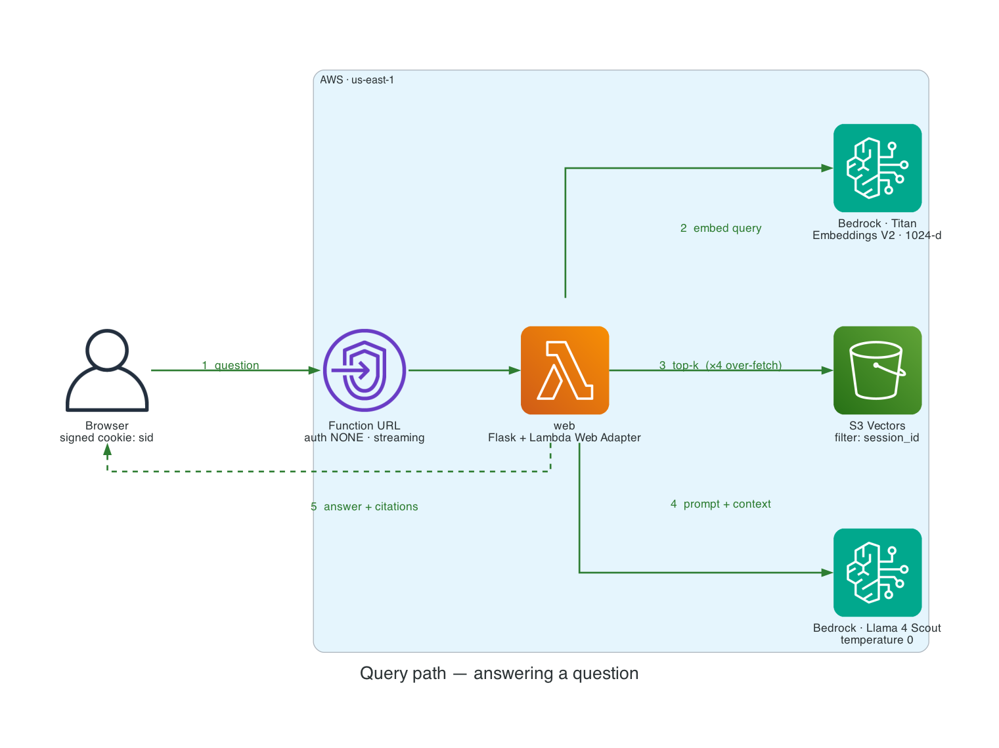
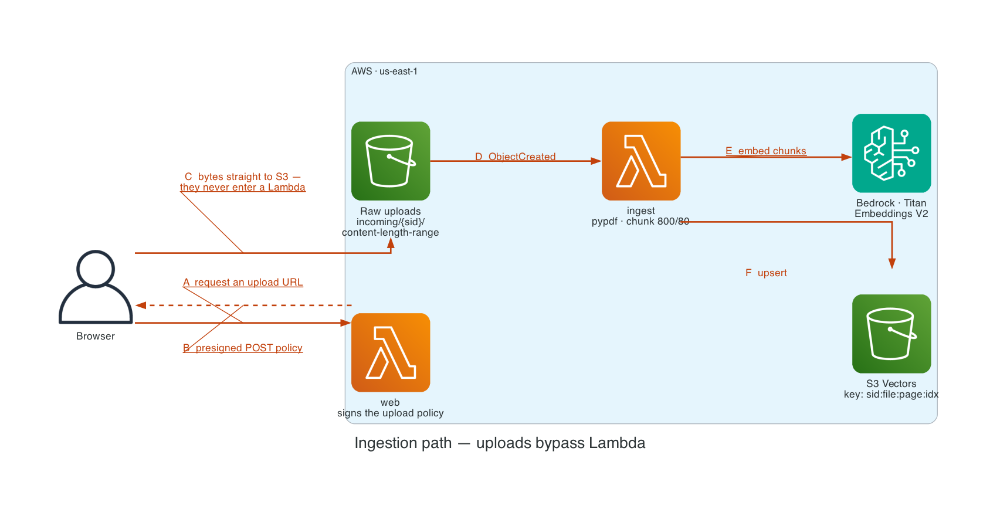
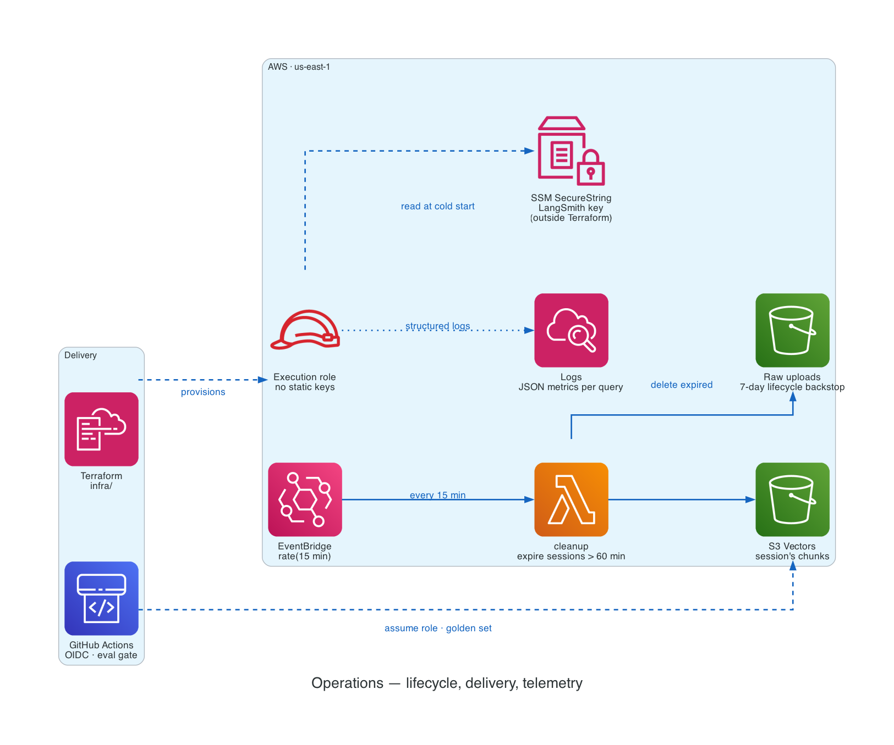
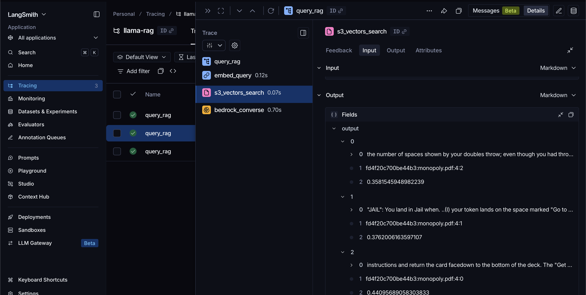
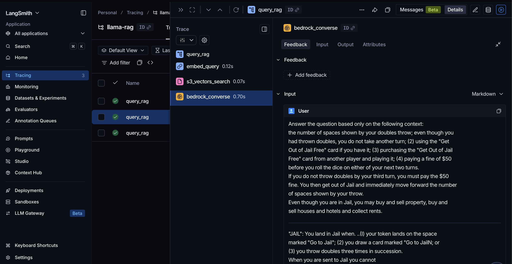

# Paper Trail

Upload PDFs, ask questions, get answers grounded in your own documents — every claim cited back to the passage it came from.

A serverless RAG system on AWS: session-isolated, evaluated, traced, deployed and torn down with one command each.

Flask · Amazon S3 Vectors · Amazon Bedrock (Titan embeddings + Llama 4) · Terraform

<!-- deploy:url -->
**[Live demo →](https://2y5mc2diynm6gdhw73r5gr5try0rfanw.lambda-url.us-east-1.on.aws/)**
<!-- /deploy:url -->


## The bug the evals caught

S3 Vectors is an approximate index and returns *fewer results than requested* — measured at roughly half:

| requested `topK` | actually returned |
|---|---|
| 5 | **2** |
| 20 | 10 |
| 100 | 40 (whole index) |

So `k=5` was quietly giving the model **2 chunks of context instead of 5**, degrading every answer, with nothing in the app aware of it. It surfaced only because the golden set failed on *retrieval* during an unrelated refactor. Fixed by over-fetching `k × 4` and re-ranking by distance. ([write-up](docs/DECISIONS.md#13-over-fetch-from-s3-vectors))

Every other significant choice is backed by a measurement:

| Decision | Evidence |
|---|---|
| Llama 4 Scout for generation | 4 models scored 6/6 on the golden set; chosen on latency (0.53s vs 0.69–0.82s) |
| Removed LangChain, kept only the text splitter | 13 packages for a ~150-line app; replacement diff was +119/−108 |
| S3 Vectors over OpenSearch Serverless | ~90% cheaper; the vector lookup is 0.07s of a 0.8s request |
| 1024-dim embeddings (not 512) | storage saving priced at ~$0.001/month against a permanently immutable index |

Dependencies went from **116 packages / 305 MB to 52 / 62 MB** — which is what made a zip-based Lambda deploy possible at all.

## Architecture

Everything inside the boundary is Terraform-provisioned. Two Lambdas share one deployment package and one execution role; **no static AWS credentials exist anywhere in the deployed system.**

**Answering a question** — five hops, no server-side state between them. The signed `sid` cookie is the only thing carried across requests.



**Getting documents in** — the app signs an upload policy and the bytes go browser → S3, never entering a Lambda invocation (which caps payloads at 6 MB). An S3 event then drives ingestion off the request path, so a large PDF never blocks an HTTP connection. Verified in production with a 7.3 MB file.



**Keeping it running** — sessions expire on a schedule, delivery is credential-free in both directions, and the one secret that must survive `terraform destroy` deliberately lives outside Terraform.



*Diagrams as code — [`docs/diagram.py`](docs/diagram.py), regenerate with `uv run python docs/diagram.py`.*

| Component | Configuration |
|---|---|
| Function URL | `authorization_type NONE`, `invoke_mode RESPONSE_STREAM` |
| Lambda `web` | arm64, 1 GB, 120 s, Lambda Web Adapter layer |
| Lambda `ingest` | arm64, 1 GB, **900 s**, same zip, `ingest.handler` |
| S3 raw uploads | presigned POST with `content-length-range`, 7-day expiry |
| S3 Vectors | 1024-d cosine, `source_text` non-filterable, ×4 over-fetch |
| Bedrock | `amazon.titan-embed-text-v2:0` · `us.meta.llama4-scout-17b-instruct-v1:0` at `temperature 0` |
| CloudWatch | 14-day retention, one structured JSON line per query |

**Why S3 Vectors.** It is the cost-optimized tier, not the low-latency tier — ~100 ms warm versus single-digit ms for in-memory HNSW, in exchange for ~90% lower cost. Generation dominates latency here, so the trade is free. A high-QPS app would tier the hot subset into OpenSearch and keep the cold corpus here.

**No LangChain, one AWS SDK.** `pypdf` and `boto3` directly; boto3 alone covers embeddings, vector storage, and generation. The only third-party piece kept is `langchain-text-splitters`, the one component with non-trivial logic.

## Tracing

Four `@traceable` decorators, **no new dependencies** — `langsmith` already ships with `langchain-core`:

```
query_rag  [chain]
  └─ embed_query        [embedding]   0.12s
  └─ s3_vectors_search  [retriever]   0.07s
  └─ bedrock_converse   [llm]         0.70s
```

Real production numbers, and the answer to "where does the latency go": **generation is 79% of it.** Optimising the vector store would be optimising the wrong term.

The retriever span gives the exact chunks, their session-scoped keys, and their distances — enough to tell whether retrieval was wrong, the document was wrong, or the *session* was wrong:



The LLM span gives the assembled prompt, not the template:



Together they are the "a user says the answer was wrong" workflow: bad chunks means retrieval, good chunks with a bad answer means prompt or model. Per-call logging cannot give you the first half — the S3 Vectors query is not a model call, so it appears in no model invocation log.

**LangSmith tracing was never LangChain-specific.** `bedrock_converse` is a plain `boto3` call and still renders as a first-class LLM span.

```bash
export LANGSMITH_TRACING=true LANGSMITH_API_KEY=ls__...
uv run python app.py
```

Two Lambda-specific details make it work: the key is read from SSM at cold start (never through Terraform state), and spans are flushed in `teardown_request` — the background exporter is killed by the Lambda freeze, so without the flush every run sits in LangSmith as "pending" forever. Overhead when disabled is ~12 µs per decorated call.

## Evals

`test_rag.py` is a golden set of factual questions verified to be answerable from the source PDFs, plus an out-of-corpus question that must be *declined*. Each case runs twice — retrieval alone, then end-to-end — so a failure localizes immediately:

| Retrieval | Answer | Diagnosis |
|---|---|---|
| ✅ | ❌ | chunk was found; the model failed to use it |
| ❌ | ❌ | embeddings, chunking, or `k` — not generation |

```bash
uv run pytest                          # 21 tests
uv run pytest test_behaviour.py        # 10 behaviour tests, 0.3s, no AWS
uv run pytest test_rag.py              # 11 golden-set tests, live Bedrock + S3 Vectors
```

**21/21 passing.** The behaviour suite runs against in-memory fakes, so it gives signal on every push even while the stack is torn down. Each of its tests maps to a bug this project actually shipped, and each was verified to *fail* when that bug is reintroduced — a suite that stays green on a broken app is worse than none.

`conftest.py` prints the resolved region, index, and models in the pytest header (eval numbers mean nothing without knowing which model produced them) and warns when a shell variable is shadowing `.env`.

## Session isolation

The endpoint is public, so one visitor must never see another's documents.

| Layer | Enforced by |
|---|---|
| `sid` in the Flask cookie | **HMAC signature** — another session's id cannot be forged |
| Retrieval scoping | **S3 Vectors server-side filter**, applied during search |
| Upload path `incoming/{sid}/…` | **S3 presigned POST policy** pins the exact key |
| Chunk id `{sid}:file:page:idx` | convention only — cleanup grouping, not a boundary |

`session_id` is a **required positional argument** on `search()`, `list_sources()`, and `clear_database()`. A `None` default meant one forgotten keyword silently answered one visitor from another's documents; now it's a `TypeError`. Global access requires passing `ALL_SESSIONS` explicitly — deliberately conspicuous, used in exactly one place.

Documents expire **60 minutes** after a session's last upload, swept every 15 minutes by a scheduled Lambda. S3 lifecycle rules are day-granular and DynamoDB TTL is best-effort within ~48 h, so neither can express an hour-scale policy; the 7-day rule stays as a backstop.

## Stateless by design

- "Which documents exist" is answered by querying the index, not a session flag or a local directory
- Chunk ids key on the document *name*, not its staging path, so re-uploading is a no-op on any instance
- Flask sessions are signed cookies, and Terraform generates a stable `FLASK_SECRET_KEY`, so they survive cold starts
- `GET /health` returns the git sha of the running code, so a stale deploy is detectable rather than silent

## Setup — from a fresh clone

Every credential is entered **once**, somewhere that survives redeploys and teardowns. Needs [Terraform](https://developer.hashicorp.com/terraform/install), [uv](https://docs.astral.sh/uv/getting-started/installation/), the AWS CLI, and an AWS account.

**1. AWS credentials — an IAM user, not root.**

```bash
aws configure                                  # key for an IAM user with AdministratorAccess
aws sts get-caller-identity --query Arn --output text
```

Must print `.../user/<name>`, not `:root` — AWS forbids root from assuming roles, and local runs assume the least-privilege role Terraform creates. No admin user yet:

```bash
aws iam create-user --user-name my-admin
aws iam attach-user-policy --user-name my-admin --policy-arn arn:aws:iam::aws:policy/AdministratorAccess
aws iam create-access-key --user-name my-admin      # feed into `aws configure`
```

**2. LangSmith key.** Optional — skip it and tracing stays off.

```bash
cp .env.local.example .env.local     # paste the key from smith.langchain.com
```

Gitignored and never overwritten: `publish.sh` regenerates `.env` wholesale but does not touch `.env.local`. `deploy.sh` copies this key into SSM, and restores it from here if the parameter goes missing.

**3. Deploy.**

```bash
./deploy/deploy.sh
```

Builds the package (cross-compiled to linux/arm64 by `uv`, no Docker), applies, writes `.env`, syncs the GitHub CI variables, updates the demo link above, and **fails if the deployed build doesn't match your HEAD commit**.

**4. Local profile — one time.**

```bash
terraform -chdir=infra output -raw aws_profile >> ~/.aws/config
```

Adds a `llama-rag` profile assuming the app's role, so local runs get exactly the Lambda's permissions. Role names are stable, so this survives teardown and rebuild.

**5. Run.**

```bash
uv venv && uv pip install -r requirements.txt
uv run pytest                 # 21 tests
uv run python app.py          # http://127.0.0.1:5001
```

**Don't `source .env`** — it exports `AWS_PROFILE`, which then outranks your admin profile and makes Terraform fail with `AccessDenied` on IAM. The app loads it in-process via `python-dotenv`.

| Secret | Home | Survives teardown |
|---|---|---|
| AWS admin key | `~/.aws/credentials` | ✅ |
| LangSmith key | `.env.local` | ✅ |
| LangSmith key (deployed) | SSM SecureString | ✅ — outside Terraform on purpose |
| App AWS credentials | none — assumed role | n/a |
| CI credentials | none — GitHub OIDC | ✅ role name is stable |

Nothing sensitive is in the repo, in `.env`, or in `terraform.tfstate`.

## Gotchas worth knowing

- **`s3vectors:GetVectors` is required alongside `QueryVectors`** — `QueryVectors` alone returns keys and distances; asking for metadata fails with AccessDenied otherwise, which reads like a query bug.
- **Index settings are immutable.** Changing dimension, distance metric, or non-filterable keys silently rebuilds the index and drops every vector.
- **`force_destroy = true`** on the vector bucket, applied *before* the destroy — without it `terraform destroy` fails while the index still holds vectors.
- **Llama 3.1+ is `INFERENCE_PROFILE`-only** and needs the `us.` prefix, plus `InvokeModel` on both the profile ARN and the underlying model with a wildcard region.
- **Bedrock model access is account-level, not IAM.** Meta needs no request; Anthropic models 403 until a console opt-in, which is why this defaults to Llama.
- **IAM is eventually consistent** — an `AccessDenied` immediately after an apply often self-resolves in ~30 s.

## Status

**Deployed and publicly reachable.** The endpoint is unauthenticated and every request spends Bedrock tokens; concurrency caps and a budget alarm bound the damage. For more than a demo, put CloudFront + WAF in front.

| | |
|---|---|
| Tests | 21/21 (10 behaviour offline, 11 golden set on live AWS) |
| Warm response | ~0.8 s end-to-end |
| Cold start | ~3.1 s init |
| Dependencies | 52 packages / 62 MB (from 116 / 305 MB) |
| Infrastructure | 37 Terraform resources, one-command teardown |
| Cost | ~$1–3/month with a budget alarm |

## Next

Reasoning and an honest gap analysis in [`docs/ROADMAP.md`](docs/ROADMAP.md); why each choice was made — including the ones that were wrong first — in [`docs/DECISIONS.md`](docs/DECISIONS.md).

- [ ] **Eval gate in CI** — golden set on every PR via OIDC, pass count in the job summary
- [ ] **Harder eval cases** — every model tested saturates the current set, so it can no longer discriminate on quality, which makes model selection unfalsifiable
- [ ] **Reranking, measured** — `flashrank` cross-encoder, retrieve 20 → rerank to 5, with before/after scores
- [ ] **Streaming responses** — the Function URL already supports it; only `/ask_question` needs to emit SSE, so time-to-first-token currently equals time-to-full-answer
- [ ] **Auth or rate limiting** — concurrency caps bound throughput, not spend
- [ ] **Agent layer** — query routing, multi-step retrieve → synthesise → verify, or an MCP server over the corpus

**Deliberately not doing:** migrating off S3 Vectors, reintroducing a framework, or a frontend rewrite.
